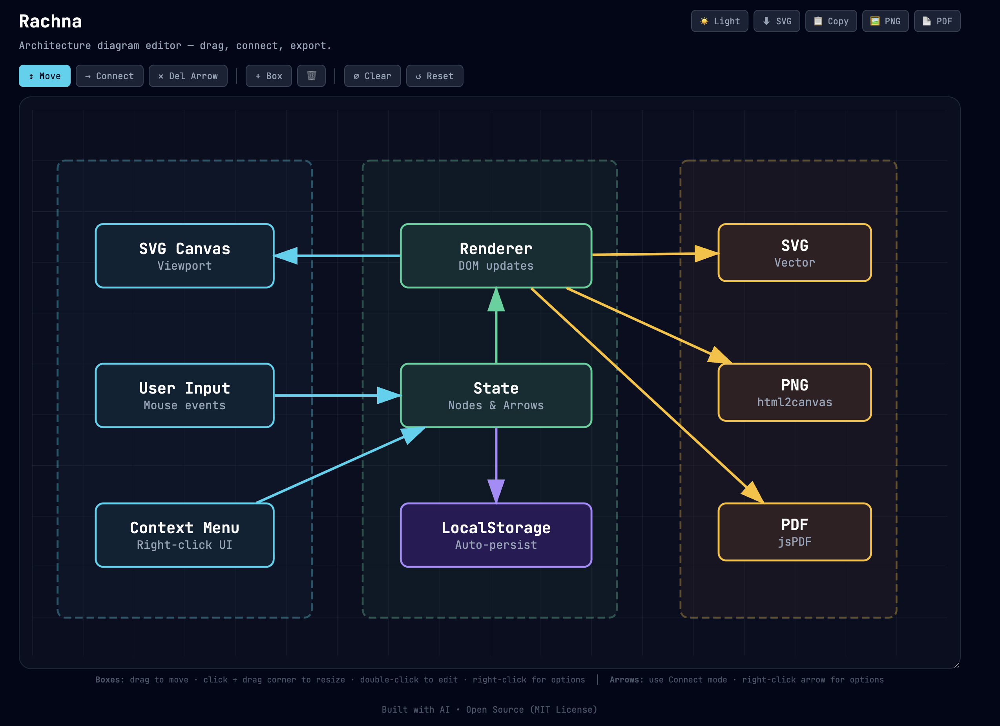
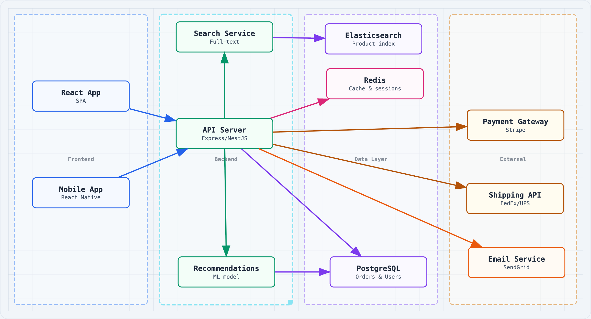
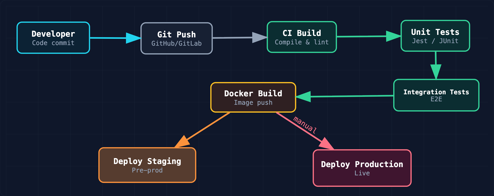
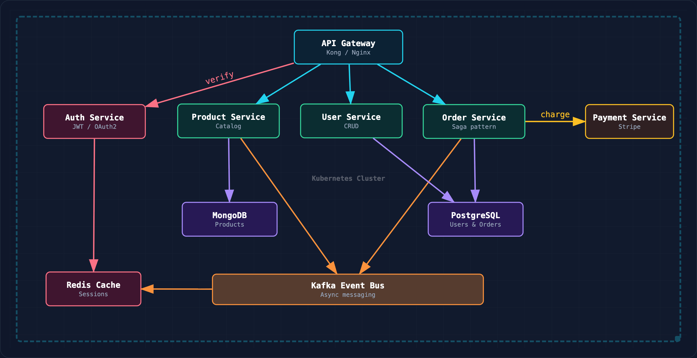
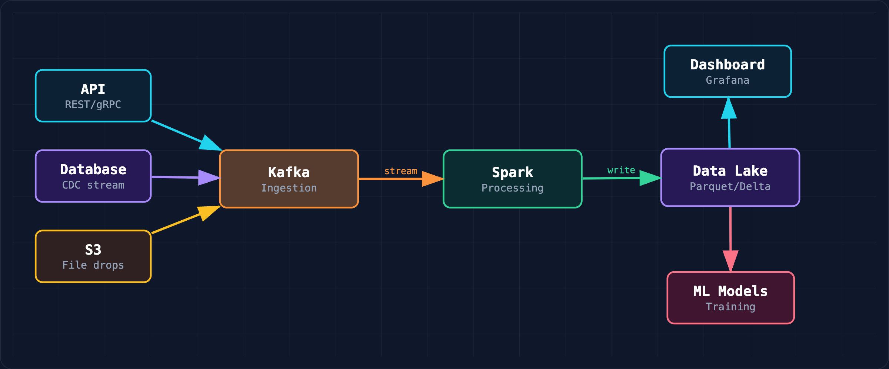

# Rachna — Architecture Diagram Editor

A zero-dependency, single-file, interactive diagram editor that runs entirely in the browser. Create, style, connect, and export architecture diagrams — no setup required.

Try it now: **https://lawlietog.github.io/rachna-architecture-diagram-editor/**

---

## Features

- **Single HTML file** — no install, no build, no server. Just open in a browser.
- **Drag & drop** — move and resize boxes freely on an SVG canvas
- **Connect** — draw directional arrows between any two boxes
- **Right-click styling** — colour (7 presets + custom hex), border width, dashed, opacity, text size, z-order
- **Arrow labels** — rotated text along arrows with configurable size and colour
- **Dark / Light theme** — one-click toggle
- **Auto-save** — persists in browser localStorage across sessions
- **Resizable canvas** — drag the container corner to fit your diagram
- **Export** — SVG (vector), PNG (high-DPI), PDF (single-page), clipboard copy
- **Reset / Clear** — reload the default diagram or start with a blank canvas

---

## How to Use

The canvas loads with a sample diagram. Click **⌀ Clear** to start with a blank canvas.

1. Click **+ Box** to add a component
2. **Drag** to move, click then drag the blue corner to resize
3. Switch to **→ Connect** mode, click source then target to draw an arrow
4. **Right-click** any box or arrow for styling options
5. **Double-click** a box to edit its text
6. Export via the top-right buttons (SVG / PNG / PDF / Copy)

---

## Screenshots

### Default (Dark Mode)

### E-Commerce Architecture (Light Mode, Custom Colours)

### CI/CD Pipeline (Dark Mode, Vertical)

### Microservices (Dark Mode, Kubernetes Boundary)

### Data Pipeline (Dark Mode, Compact)

---

## Hosting

This tool is hosted on GitHub Pages. All edits happen in the visitor's browser via localStorage — the source file on GitHub is never modified. To self-host, just serve `index.html` from any static host.

---

## Built With

This entire tool — HTML, CSS, and JavaScript — was built with AI assistance (Claude/Kiro). The design system (colour palette, typography, layout patterns) is adapted from the [Architecture Diagram Generator](https://github.com/Cocoon-AI/architecture-diagram-generator) skill by [Cocoon AI](https://github.com/Cocoon-AI), licensed under MIT.

---

## Colours

7 preset swatches available via right-click: `#22d3ee` · `#34d399` · `#a78bfa` · `#fbbf24` · `#fb7185` · `#fb923c` · `#94a3b8` — plus custom hex input.

---

## License

[MIT](LICENSE)
